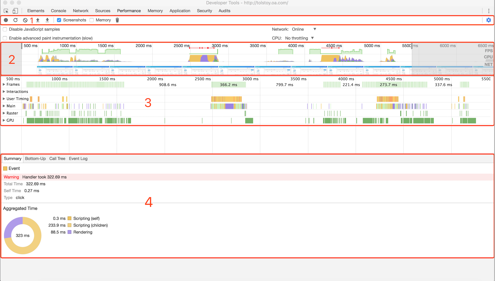
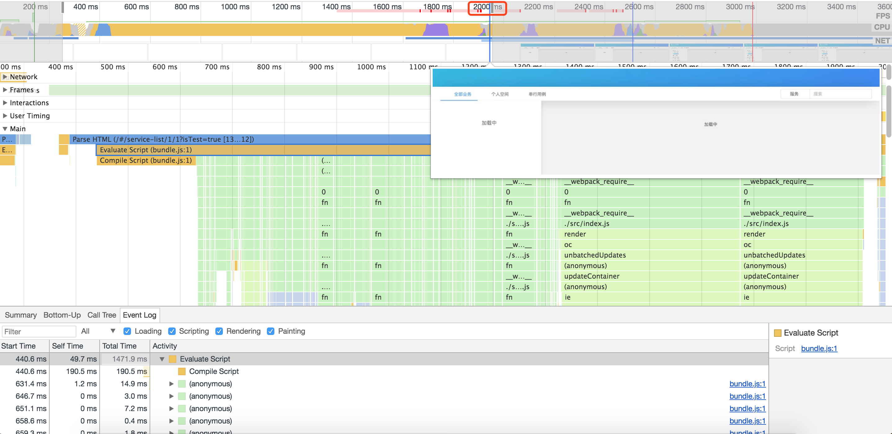
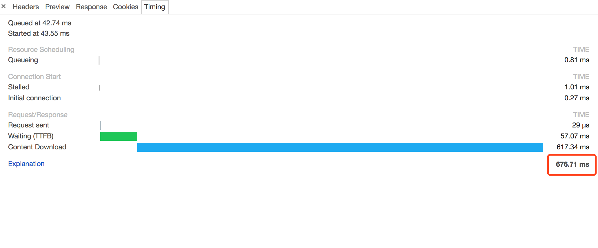
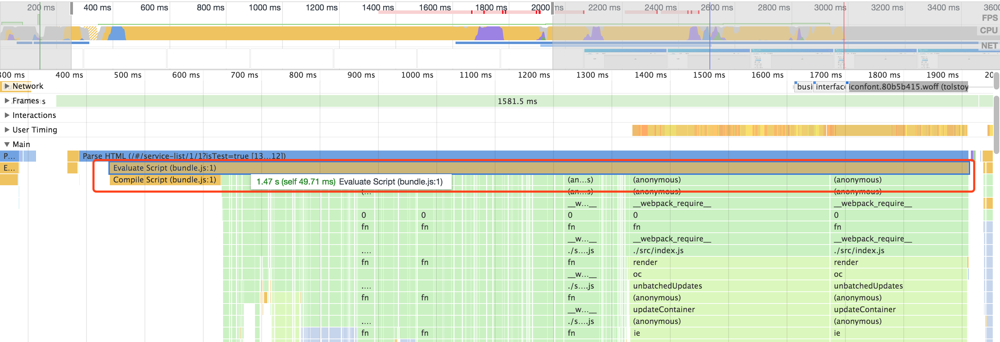
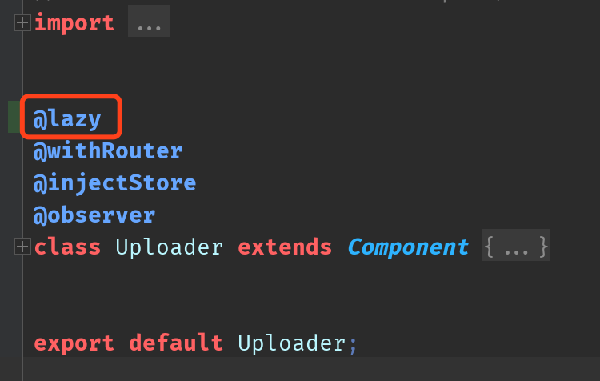
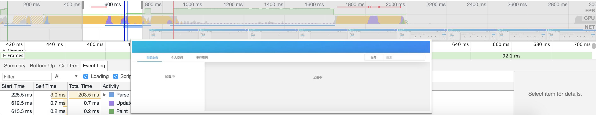
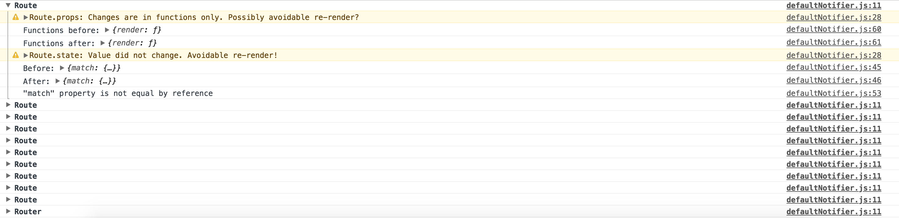
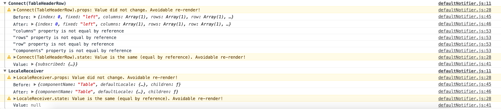
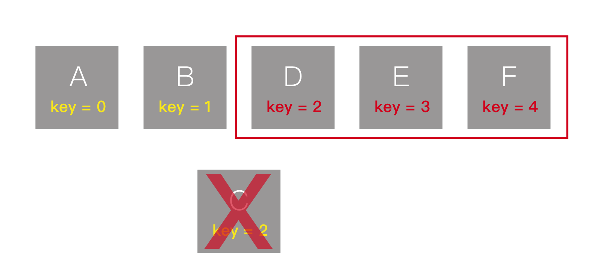

# React Web App Optimization In Real World
​近些年随着网络和终端设备的性能提高，前端技术的发展与完善，各类纷繁复杂的单页 Web 应用（SPA）相继出现，Web 被赋予越来越重要的使命。配合 React 等 Web 框架，可以迅速地开发出功能强大的 SPA。不过，随着应用功能的迭代与体积的增加，Web 应用的性能对用户体验的影响也会日益凸显，因此，针对性的性能优化手段在 Web 开发中是必不可少的。

## 1. Chrome Performance Inspect 简介
工欲善其事必先利其器，在做性能优化时，需要选择一个强大的性能监控工具。在 React 16 之前，Facebook 官方支持使用 React-addons-perf 来进行 React 的性能检测，不过在 React 16 版本之后，React 停用了对 React-addons-perf 的支持。现在 Facebook 推荐使用使用强大的 Chrome Dev Tools 的 Performance Inspect 功能。
要使用 Performance Inspect 功能，只需要打开 Chrome Dev Tools，选择 Performance，点击记录按钮开始记录，等待记录完毕将会出现类似这样的界面：



从 1 到 4 每个区域分别为:
1. 操作区域：如录制、刷新分析、清除结果等一系列操作
2. 概览区域 ：屏幕内容及性能影响因素（如：CPU、网络、FPS 等）随时间的变化
3. 火焰图区域：记录具体性能消耗，相当于概览区域的完全版。虽然他们都是性能信息视图，但在该区域中，信息会变得更加详细、更加精准，甚至连每一次点击事件处理处理、每一次重绘视图等都有详细的记录，一般我们查看性能信息都在该区域进行。
4. 总结区域：对选中的性能消耗记录进行总结，便于我们找到性能瓶颈所在。

在该工具中，每种颜色代表不同的意义：
* 黄色：代表执行脚本的性能消耗
* 绿色：代表渲染文档的性能消耗
* 紫色：代表更新布局与样式的性能消耗
* 灰色：代表其他性能消耗

更详细的参考这里不再赘述，可以参考这篇文档：[如何使用 Timeline 工具 —— Google Developers](https://developers.google.com/web/tools/chrome-devtools/evaluate-performance/timeline-tool)

## 2. 提高初始化速度
下面我将结合最近在开发的 Tolstoy（托尔斯泰，Tolstoy.oa.com： 一个以 PB 为核心的自动化测试系统）来讲怎么一步一步地优化 Web 性能。
首先，我们需要我们需要找出我们的性能瓶颈所在：打开 Chrome  Performance Inspect，点击记录并刷新页面，记录完成。





我们看到：虽然 bundle.js 主文件在 676ms 之后已经加载完毕，但 2s 之后才开始加载出主页面。



继续看发现解析和执行 bundle.js 花了 1.47s，也就是说在请求完 bundle.js 后的 1.47s 之内页面都处于完全空白状态，这导致在2s 之后 App 才初始化完毕，严重影响用户体验！
 
目前所有的业务逻辑代码、组件与依赖的框架等都打包在这一个文件里面，必然会导致执行这一个文件耗时较长，我们需要把依赖单独打包，保持 bundle.js 的轻量，不管是请求还是执行文件都会更快。同时，对组件使用懒加载，默认只加载必要的组件，以提高初始化速度。

### 配置 Webpack Dll Chunk：
1. 首先新建 Webpack.dll.js：
```javascript
const webpack = require('webpack');
const path = require('path');

const react = ["react", "react-dom", "react-router-dom", "mobx", "mobx-react"];
const antd = ["antd"];
const lib = ["react-json-view", "react-monaco-editor"];

module.exports = {
    context: path.join(__dirname, '../dll'),
    output: {
        path: path.join(__dirname, '../dll'),
        filename: '[name].dll.js',
        library: '[name]_[hash]',
    },
    entry: {
        "react": react,
        "antd": antd,
        "lib": lib,
    },
    plugins: [
		  new webpack.IgnorePlugin(/^\.\/locale$/, /moment$/),
        new webpack.DllPlugin({
            path:  path.join(__dirname, '../dll', '[name]-manifest.json'),
            name: '[name]_[hash]'
        })
    ]
};
```
2. 然后在 Terminal 里运行 `webpack --config ./config/webpack.dll.js`，打包出 dll chunks。
3. 最后，在 webpack 配置文件里加上：
```javascript
{
    plugins: [
        new webpack.DefinePlugin(env.stringified),
        ...['react', 'lib', 'antd'].map(name => new webpack.DllReferencePlugin(({
            context: __dirname,
            manifest: require(`../dll/${name}-manifest.json`),
        }))),
        new AddAssetHtmlPlugin(['react', 'lib', 'antd'].map(name => ({
            filepath: require.resolve(`../dll/${name}.dll.js`),
            hash: true,
            includeSourcemap: false
        })))
    ]
}
```

更多信息可以参考：[WebpackDllPlugin](https://webpack.js.org/plugins/dll-plugin/#dllreferenceplugin)

### 使用 LazyLoad
1. 首先运行 `npm install --save react-lazyload`
2. 实现两个 Helper Function 来封装 LazyLoad 组件：
```jsx harmony
function getDisplayName(WrappedComponent) {
    return WrappedComponent.displayName ||
        WrappedComponent.name || 'Component';
}

function lazy(Component) {
    const HOC = props => <LazyLoad><Component {...props} /></LazyLoad>;
    HOC.displayName = `LazyHOC(${getDisplayName(Component)})`;
    return HOC;
}
```
3. 在组件声明时使用 LazyLoad 封装：

当然，如果你不喜欢装饰器语法，也可写成`export default lazy(Uploader);`

经过上面的步骤，再次进行性能测量：



Bingo！我们的 App 的初始化耗时从 2s 优化到 700 ms，速度提升 65%！

## 3. 提升应用内响应
除了初始化速度之外，App 内的响应速度也是优化的一方面。得益于 React 优秀的设计与 VirtualDOM 高效的 Diff 与 Patch，开发者并不需要特别需要关注 App 的性能，唯一需要注意的是：尽量避免不必要的 rerender。
这里我们需要使用另一个工具：[why-did-you-update](https://github.com/maicki/why-did-you-update)，它会在 Virtual-DOM 产生不必要的更新时轰炸你的控制台！

首先，运行 `npm install --save-dev why-did-you-update`。
然后，编辑你的入口文件：
```jsx
import { whyDidYouUpdate } from 'why-did-you-update';
if (process.env.NODE_ENV !== 'production') {
    whyDidYouUpdate(React);
}
```

最后，刷新页面：


可以看到 “Route” 组件有 10 次不必要的 rerender，“Route” 是在 “App” 组件内被引入的，我们看 “App” 组件：
```jsx harmony
class App extends Component {
    render() {
        return (
            <HashRouter>
                <div id="app">
                    <Nav />
                    <Uploader />
                    <div className="main-container">
                        <LeftTree />
                        {routes.map(route => <Route {...route} />)}
                    </div>
                </div>
            </HashRouter>
        );
    }
}
```
很明显，App 组件只是单纯的返回值，并没有内部状态，这时应该优先 **使用 PureComponent**。可以把 PureComponent 看做是默认实现了 shouldComponentUpdate 的组件，只要传入值不变，就一定不会重新渲染。这里 App 并没有 props（传入值），也就不会产生不必要的 render 了。

更改 “App” 组件为：
```jsx harmony
class App extends PureComponent { ... }
```

另外，在每次删除用例（去掉表格中的一行）时，也会产生 render：


我们看 render 该表格的组件：
```jsx harmony
class UseCaseList extends Component {
	  ...
	  render() {
        const { store: { ucses } } = this.props;
        return (
            <div id="usecase-list" className="main-content">
                <Loading if={!ucses} />
                <Table
                    else
                    title={this.getTitle}
                    dataSource={toJS(ucses.map((i, index) => ({ ...i, key: index })))}
                    columns={this.columns}
                />
            </div>
        );
    }
}
```

在这里渲染 List 时使用了 `key = index` ，这会在去掉 List 中的一个 Item 时，引起该 Item 之后的所有 Item 重新渲染。
因为 React 的虚拟 DOM 会使用依赖一个独一无二的 Key 去缓存一个节点，避免反复渲染。现在假设我们在一个 List 中有如图6个 Item 使用 Index 作为 Key 渲染：

当我们删掉 “C” item 时：

“C” 之后的所有 Item 的 Key 都会发生改变，一旦 Key 发生改变，React 就会认为这是一个新的组件二把它重新渲染一遍，显然这会造成性能浪费。因此，应该**合理使用 Key** 来避免 rerender。

因此，我们渲染 Table 的数据可以改为：
```jsx harmony
ucses.map((i, index) => ({ ...i, key: i.id }))
```

还有很多其他的优化点如：**使用 shouldComponentUpdate**、**使用 Immutable.js**、**使用 Shallow Compare**、**使用无状态组件（Pure Function）** 等，由于篇幅及时间原因这里不再赘述。

该系列持续更新，欢迎关注 [HuQingyang (胡青杨) · GitHub](https://github.com/HuQingyang)

